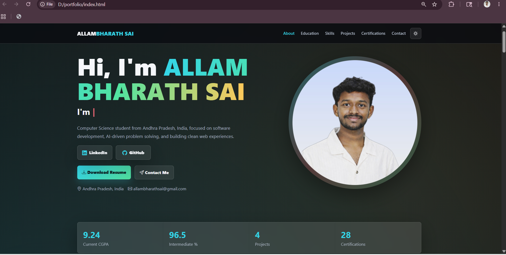
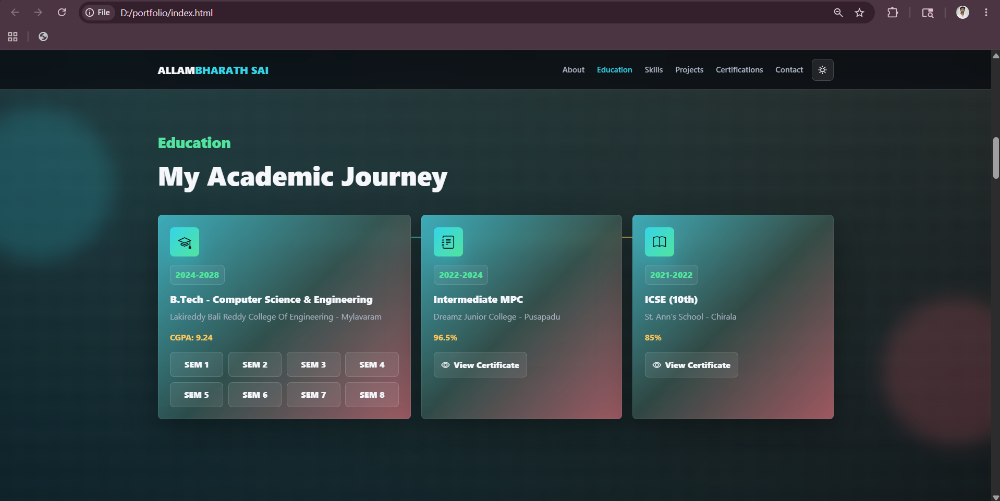
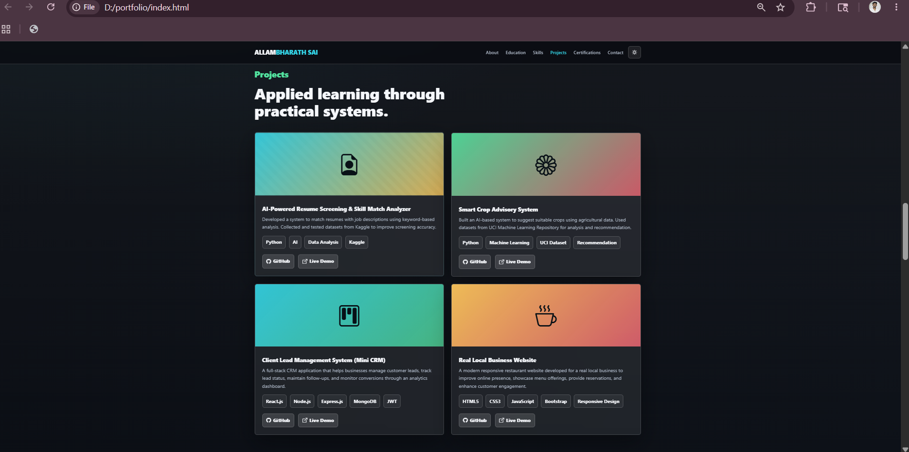
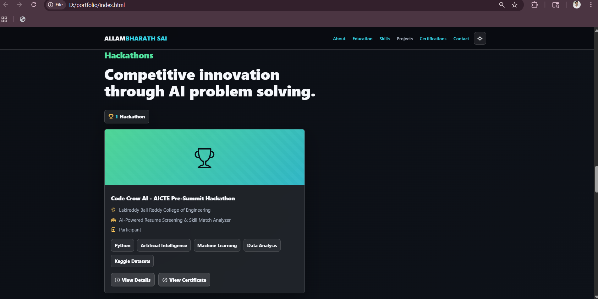
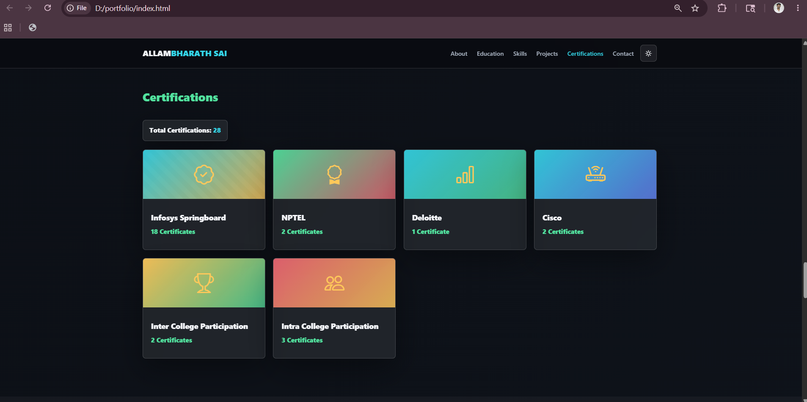
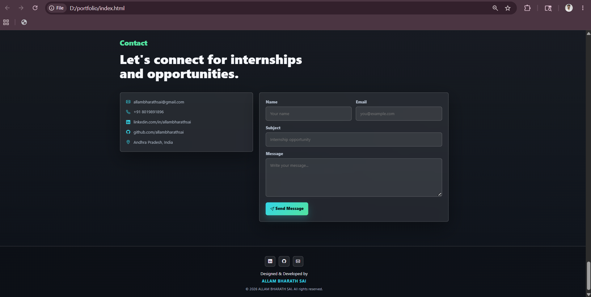

# 🚀 Personal Portfolio Website

> A modern, responsive, and interactive portfolio website showcasing my education, technical skills, projects, certifications, hackathons, and professional profile.


---


## 🌐 Live Demo

🚀 Visit the Portfolio Website Here:

👉 [Live Demo](https://allambharathsai.github.io/My_-Portfolio-_/)

---

# 📌 Project Overview

The **Personal Portfolio Website** is a modern, responsive, and interactive web application developed to showcase my academic achievements, technical skills, certifications, projects, hackathon participation, and professional profile.

The portfolio serves as a **digital resume and professional branding platform**, enabling recruiters, employers, and professionals to explore my qualifications, technical expertise, and project experience through an engaging user interface.


---

# 🎯 Problem Statement

Traditional resumes provide limited interaction and often fail to effectively showcase technical skills, certifications, project work, and practical experience.

A personal portfolio website solves these challenges by:

- Creating a professional online presence
- Showcasing projects and achievements
- Highlighting technical skills
- Demonstrating web development capabilities
- Providing easy access to certifications and academic records
- Improving visibility to recruiters and employers
- Serving as a digital resume

---

# ✨ Key Features

## 🏠 Hero Section

- Professional introduction
- Animated role display
- Resume download option
- Contact button
- LinkedIn integration
- GitHub integration
- Responsive profile section

---

## 👨‍💻 About Me

- Career objective
- Professional summary
- Personal introduction
- Technical interests
- Career aspirations

---

## 🎓 Education Section

- Academic timeline
- B.Tech details
- Intermediate details
- ICSE details
- Semester-wise certificate viewer
- Interactive certificate preview system

---

## 💻 Technical Skills

### Programming Languages

- C
- Java
- Python

### Database

- SQL

### Data Structures

- Arrays
- Strings
- Linked Lists
- Stacks
- Queues

### Web Technologies

- HTML5
- CSS3
- JavaScript

### Tools

- VS Code
- Git
- GitHub
- MS Word
- MS Excel
- MS PowerPoint

---

## 🚀 Projects

### 🤖 AI-Powered Resume Screening & Skill Match Analyzer

- Developed a system to match resumes with job descriptions using keyword-based analysis.
- Utilized Kaggle datasets to improve screening accuracy.
- Enhanced candidate-job matching efficiency.

### 🌱 Smart Crop Advisory System

- Built an AI-based crop recommendation system.
- Used agricultural datasets from the UCI Machine Learning Repository.
- Assisted in crop selection based on environmental conditions.

### 👥 Client Lead Management System (Mini CRM)

- Developed a full-stack CRM application.
- Managed customer leads and follow-ups.
- Implemented secure authentication and dashboard analytics.

### 🍽️ Real Local Business Website

- Designed and developed a responsive restaurant website.
- Improved online visibility and customer engagement.
- Showcased menu offerings and reservation facilities.

---

# 🏆 Hackathons

## CODE CROW AI – AICTE Pre-Summit Hackathon

Participated in **CODE CROW AI – AICTE Pre-Summit Hackathon** conducted by the Department of Artificial Intelligence and Data Science at Lakireddy Bali Reddy College of Engineering.

### Project Developed

**AI-Powered Resume Screening & Skill Match Analyzer**

### Skills Gained

- Artificial Intelligence Concepts
- Problem Solving
- Team Collaboration
- Innovation Thinking
- Data Analysis
- Technical Presentation
- Real-World Project Development

---

# 📜 Certifications

## NPTEL

- Introduction to Industry 4.0 and Industrial Internet of Things (Elite + Silver Certification)
- The Joy of Computing Using Python (Elite Certification)

## Infosys Springboard

- Python Foundation
- Introduction to Artificial Intelligence
- Introduction to Deep Learning
- Prompt Engineering
- OpenAI GPT-3 for Developers

## Deloitte

- Data Analytics Job Simulation

## Cisco Networking Academy

- Python Essentials 1
- Python Essentials 2

## Inter College Participation

- Technical Events
- Workshops
- Competitions

## Intra College Participation

- Technical Events
- Coding Competitions
- Workshops

---

# 🌟 Additional Features

### 📄 Resume Section

- Resume Preview
- Download Resume

### 📞 Contact Section

- Contact Form
- Email Integration
- Phone Number
- LinkedIn Profile
- GitHub Profile

### 🎨 UI Features

- Dark Theme
- Glassmorphism Design
- Smooth Animations
- Responsive Layout
- Mobile Friendly
- Interactive Certificate Viewer
- Downloadable Certificates
- Hover Effects
- Professional UI/UX

---

# 🛠️ Technologies Used

| Category | Technologies |
|-----------|-------------|
| Frontend | HTML5, CSS3, JavaScript |
| Framework | Bootstrap 5 |
| Icons | Bootstrap Icons |
| Animations | AOS Library |
| Version Control | Git, GitHub |
| Development Tool | Visual Studio Code |

---

# 🚀 Skills Demonstrated

- Frontend Web Development
- Responsive Web Design
- UI/UX Design
- JavaScript Interactivity
- Portfolio Development
- Professional Branding
- Website Optimization
- Git & GitHub Workflow
- Project Presentation
- Problem Solving

---

# 📁 Project Structure

```text
FUTURE_FS_01/
│
├── index.html
├── certificate.html
├── README.md
│
├── css/
│   └── styles.css
│
├── js/
│   └── main.js
│
├── assets/
│   ├── images/
│   ├── certificates/
│   │   ├── btech/
│   │   ├── school/
│   │   ├── certifications/
│   │   ├── hackathons/
│   │   └── participation/
│   │
│   └── resume/
│       └── resume.pdf
│
└── screenshots/

```

---

# ⚙️ Installation

## Clone Repository

```bash
git clone https://github.com/allambharathsai/My_-Portfolio-_.git
```

## Navigate to Project Folder

```bash
cd My_-Portfolio-_
```

## Run Website

Simply open:

```text
index.html
```

in your preferred browser.

---

# 📸 Project Screenshots

## 🏠 Hero Section

Professional landing section with introduction, social links, and resume access.



---

## 🎓 Education Section

Academic timeline with semester-wise certificate viewer.



---

## 🚀 Projects Section

Showcase of academic and internship projects.



---

## 🏆 Hackathons Section

Hackathon participation details and project showcase.



---

## 📜 Certifications Section

Interactive certification viewer with certificate previews.



---

## 📞 Contact Section

Professional contact form and social media connectivity.



---

# 🎓 Learning Outcomes

Through this project, I gained practical experience in:

- Responsive Web Development
- Modern UI/UX Design
- JavaScript Functionality
- Interactive Web Components
- Portfolio Development
- Professional Branding
- Website Optimization
- Git & GitHub Workflow

This project enhanced my understanding of creating professional portfolio websites that effectively showcase technical skills, achievements, and project experience.

---

# 🎯 Project Outcome

The portfolio successfully serves as a professional digital identity, allowing recruiters, employers, and professionals to explore my:

- Technical Skills
- Academic Achievements
- Projects
- Certifications
- Hackathon Participation
- Resume
- Contact Information

through a modern and interactive platform.

---

# 🚀 Future Enhancements

- Blog Integration
- Visitor Analytics Dashboard
- Backend Contact Form Integration
- Project Filtering System
- Multi-Language Support
- AI Chat Assistant
- Visitor Tracking Analytics
- Dynamic Project Management

---

# 👨‍💻 Developer

## ALLAM BHARATH SAI

**B.Tech Computer Science & Engineering**

Passionate about:

- Full Stack Development
- Artificial Intelligence
- Web Technologies
- Software Engineering
- UI/UX Design
- Problem Solving
- Real-World Application Development

### Technical Skills

- HTML5
- CSS3
- JavaScript
- Bootstrap 5
- Python
- Git
- GitHub

### Connect With Me

**GitHub**  
https://github.com/allambharathsai

**LinkedIn**  
https://www.linkedin.com/in/allambharathsai/

---

© 2026 ALLAM BHARATH SAI. All Rights Reserved.
